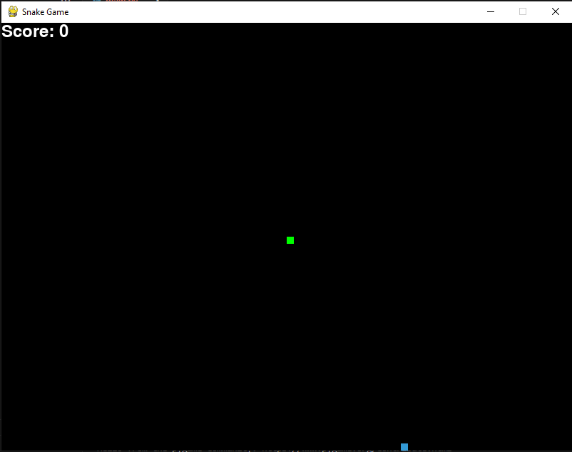

# Snake Game



## Description

Le **Snake Game** est une implémentation classique du jeu de serpent en utilisant Python et Pygame. Le joueur contrôle un serpent qui se déplace sur l'écran et doit manger de la nourriture pour grandir. Le but du jeu est d'éviter de heurter les murs ou de se mordre la queue tout en atteignant la plus grande longueur possible.

### Fonctionnalités :

- Mouvement fluide du serpent à l'aide des flèches directionnelles.
- La nourriture apparaît aléatoirement sur l'écran.
- Le serpent grandit lorsqu'il mange de la nourriture.
- Le score est affiché en haut de l'écran.
- Gestion des conditions de défaite (collision avec les murs ou avec soi-même).
- Option de rejouer ou de quitter après avoir perdu.

## Prérequis

Avant de pouvoir exécuter ce projet, vous devez installer les dépendances suivantes :

- Python 3.x
- Pygame

### Installation de Pygame

Vous pouvez installer Pygame en utilisant pip :

```bash
pip install pygame
